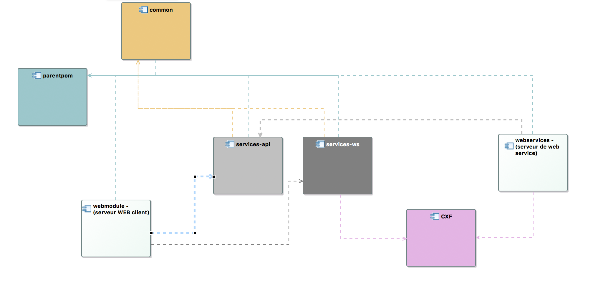
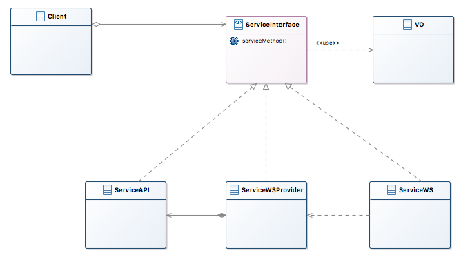

# proof-of-concept-switch-ws-or-api
A java Eclipse workspace with a complete example to switch easily from WS to API java call and vice-versa

Ce projet est une démonstration d'une technique de switch très simple entre le mode d'appel par API et le mode d'appel WS avec la librairie apache-cxf **sans utiliser spring**. Il fournit un exemple de structure de projets volontairement éclatée bâtis autour de Maven.

Notre équipe en a eu besoin récemment, je partage donc le résultat de mes recherches :

## Présentation du worskpace
Le workspace est composé de 6 projects maven et correspond à 1 seule application web :

|Projet|Fonction|
|---   |---     |
|[parentpom](./parentpom)   |Ce projet contient le pom parent pour les dépendances et la configuration Maven commune. Les projets common, services-api et services-ws pourraient en être des modules.|
|[common](./common)      |Le projet common contient la clé de voûte du swith : Les interfaces de services, les VOs, et les exceptions commune, généralement ServiceException et TechniqueException|
|[services-api](./services-api)|Ce projet est la couche service de l'application. Il implémente les interfaces de 'common' et utilise les VO définie dans common. Service API ne dépend que de common.      |
|[services-ws](./services-ws) |Ce projet est le client dont a besoin un projet client pour accèder au service web. La structure de ce projet, package compris, doit être identique à services-api. Il ne faut jamais importer services-api et services-ws en même temps.|
|[webmodule](./webmoduled)   |Ce projet est le serveur web client. C'est lui qui référence services-api *OU* services-ws|
|[webservices](./webservices) |Ce projet est le serveur de Web services. Il dépend de services-api.        |



Le projet webmodule ne dépend QUE de services-api *OU* de services-ws, jamais les 2. Dans le cas où une partie est exposée et l'autre non, il faut éclater services-xxx en autant de projets que groupes de services.

## Raisons
Un appel WS est typiquement environ 1000 fois plus lent qu'un appel par API java. C'est donc principalement la performance qui nous pousse à chercher à basculer de façon _transparente_ d'un protocole à l'autre. 

La bascule doit être aussi simple que de modifier une ligne dans un fichier pom.xml :
```xml
		<dependency>
			<groupId>dcn.ovh</groupId>
<!-- 			<artifactId>services-api</artifactId> -->
			<artifactId>services-ws</artifactId>
			<version>0.0.1-SNAPSHOT</version>
		</dependency>
````
La bascule se fait simplement en commentant service-ws et en décommentant services-api.

Nous préférons le code ouvert, 'sans magie à la spring'. Le projet fait usage de CXF exclusivement par programmation.

Enfin, nous préférons voir nos développeurs travailler en mode java API en développement, puis d'activer le mode WS pour les tests d'intégration. 

## Principe
A partir du projet 'webmodule', un appel à un service (ou webservice) java se fait comme suit :

```java
		Student student = new Student();
		student.setName("Hugo");
		long start = System.nanoTime();
		student = Coordination.students.changeName(student);
		out.print(student.getName());
		out.print("<br />");
		long time = System.nanoTime() - start;
		out.print(time/1000000.0 + " ms");
		
		try {
			Coordination.students.changeNameWithException(student);
			out.print("<br /> NO EXCEPTION");
		} catch (Throwable t) {
			out.print("<br />Exception : " + t.getMessage();
		}
```

Les exceptions remontées doivent se comporter exactement de la même façon en mode java API ou WS. La seule différence est qu'une RuntimeException  non déclarée dans l'interface du projet 'common' est encapsulée dans une RuntimeException 'SOAPFault' quand le mode WS est activée.

## Mise en oeuvre


Le découpage en module MAVEN décrit plus haut permet de tirer les dépendances nécessaires sans chevauchement. Attention toutefois, 'ServiceAPI' et 'ServiceWS' sont dans des modules maven différents, mais ne doivent jamais être déclarés ensemble dans un pom.xml. En effet, ces 2 modules ont des noms de packages et de classe identiques.  

N'hésitez pas à adapter ce code, si tant est que vous en ayez besoin.